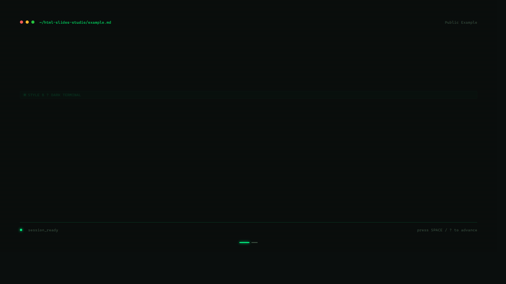
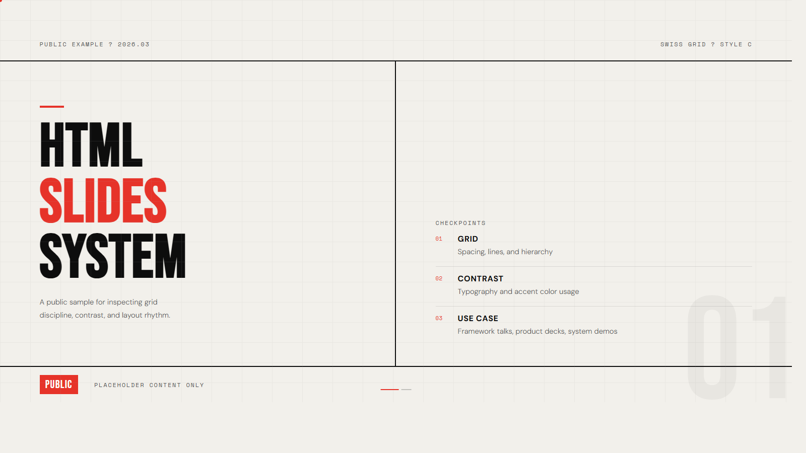
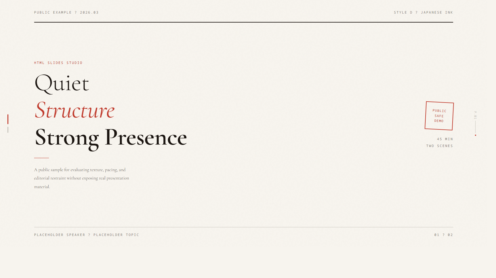

# HTML Slides Studio

`html-slides-studio` is packaged as a Codex skill for turning a detailed outline, manuscript, or topic brief into a high-aesthetic, editable, exportable single-file HTML slide deck.

`html-slides-studio` 当前以 Codex skill 的形式打包，用来把较详细的大纲、文稿或主题材料，转成高审美、可编辑、可导出的单文件 HTML 演示文稿。

The packaging in this repository targets Codex directly. The workflow, references, templates, and output format are portable, so they can also be adapted for other coding agents.

这个仓库里的直接安装路径面向 Codex；但其中的方法论、参考规则、模板资产和输出形态本身是可迁移的，理论上也可以转化后复用于其他 coding agent。

This public repository contains the sanitized public version only:

这个公开仓库保存的是脱敏后的公开版本：

- Placeholder content only
- No real course manuscripts
- No client materials
- No personal QR codes or contact details

- 仅包含占位示例内容
- 不包含真实课程文稿
- 不包含客户材料
- 不包含个人二维码或联系方式

---

## Preview

Open the current public example decks:

直接打开当前公开示例：

- [examples/example-b-terminal.html](examples/example-b-terminal.html)
- [examples/example-c-swiss.html](examples/example-c-swiss.html)
- [examples/example-d-ink.html](examples/example-d-ink.html)

Static preview images:

静态预览图：





These examples are copied from the standalone public template files, not from the older private training deck.

这些 example 直接对应公开模板，不再沿用之前那套私有培训 deck 的变体。

Public examples currently highlight `B / C / D`. The `A` system shares the generic scaffold-backed warm-editorial base used by `template-a-warm-editorial.html` and `slides-template-v3.html`.

当前公开 example 先展示 `B / C / D` 三套；`A` 风格对应的是由 `template-a-warm-editorial.html` 和 `slides-template-v3.html` 共同承载的暖纸编辑基底。

---

## What This Is

This skill is not meant to blindly invent an entire talk from scratch.

这个 Skill 不是“随便给一句主题就替你乱生成整场演讲”的工具。

Its core workflow is:

它的核心工作流是：

1. Choose a design language
2. Fill in the missing talk inputs
3. Plan the full page list first
4. Wait for confirmation
5. Generate or revise the final HTML deck

1. 先选设计语言
2. 再补齐演讲信息
3. 先规划整套页纲
4. 等确认后再生成
5. 再输出或修改最终 HTML

This structure is the main quality guardrail of the skill.

“先规划、后生成”这层结构，是它最重要的质量护栏。

---

## Portability

Direct installation in this repository is Codex-specific:

这个仓库里的直接安装方式是 Codex 专用的：

- `SKILL.md` and `agents/openai.yaml` follow Codex skill conventions
- the trigger form is `Use $html-slides-studio ...`
- the example install path is `~/.codex/skills/...`

- `SKILL.md` 和 `agents/openai.yaml` 遵循的是 Codex skill 约定
- 触发形式是 `Use $html-slides-studio ...`
- 示例安装路径是 `~/.codex/skills/...`

What is portable across other coding agents:

真正可迁移到其他 coding agent 的部分是：

- the deck-planning workflow
- the design-language rules
- the implementation constraints
- the HTML templates and scaffold assets
- the example output format

- 页纲优先的生成流程
- 四套设计语言规则
- 实现约束和质量标准
- HTML 模板与脚手架资产
- 最终输出形态

If you use another coding agent, do not assume it can install this folder unchanged. Reuse the templates, references, and workflow rules, then adapt them to that agent's own packaging mechanism.

如果你使用的是别的 coding agent，不要假设它能原样安装这个文件夹。更合理的做法是复用模板、references 和工作流规则，再按该 agent 自己的封装方式转写。

---

## Why HTML Instead Of PPT

The point is not novelty for its own sake. In high-interaction, high-aesthetic, fast-iteration scenarios, HTML is often a better medium for AI-assisted editing than PPT.

重点不是“为了炫技而不用 PPT”，而是在高交互、高审美、频繁迭代的场景里，HTML 往往比 PPT 更适合作为 AI 参与编辑的媒介。

- HTML/CSS/JS is plain text, so AI can patch it precisely
- Presentation and editing can coexist in the same file
- Front-end interaction and motion are more flexible than traditional PPT
- Versioning and template reuse are easier

- HTML/CSS/JS 是纯文本，AI 更容易做局部修改
- 展示和编辑可以共存于同一个文件
- 前端交互和动效的自由度高于传统 PPT
- 更容易做版本管理和模板复用

---

## Four Design Languages

The skill ships with four visual systems:

内置四套设计语言：

1. `A · Warm Editorial / 暖纸编辑`
2. `B · Dark Terminal / 深空终端`
3. `C · Swiss Grid / 包豪斯网格`
4. `D · Japanese Ink / 日式墨稿`

Primary template assets:

主要模板资产：

- [assets/template-a-warm-editorial.html](assets/template-a-warm-editorial.html)
- [assets/template-b-terminal.html](assets/template-b-terminal.html)
- [assets/template-c-swiss.html](assets/template-c-swiss.html)
- [assets/template-d-ink.html](assets/template-d-ink.html)

---

## Feature Overview

The public version currently includes:

公开版当前包括：

- Single-file HTML output
- 16:9 slide layout
- Page-plan confirmation before code generation
- Presenter view / speaker notes
- Front-end edit mode
- Local autosave
- `Ctrl+S` / `Cmd+S` full-document save
- Full HTML serialization
- Image insertion, drag, and resize
- Print CSS for per-slide PDF export

- 单文件 HTML 输出
- 16:9 演示比例
- 先确认页纲，再生成代码
- 演讲者视图 / speaker notes
- 前端编辑模式
- 本地自动保存
- `Ctrl+S` / `Cmd+S` 保存整份 HTML
- 完整 HTML 序列化保存
- 图片插入、拖拽与缩放
- 逐页 PDF 导出所需的打印样式

Save behavior:

保存行为说明：

- If File System Access API is available and permission is granted, the deck can write back directly to the `.html` file
- Otherwise it falls back to downloading a fully updated HTML file

- 如果浏览器支持 `File System Access API` 且用户授权，页面可以直接写回 `.html` 文件
- 如果当前环境不支持，就会退化为下载一份完整更新后的 HTML 文件

---

## Repository Structure

```text
.
├── SKILL.md
├── README.md
├── LICENSE
├── agents/
│   └── openai.yaml
├── assets/
│   ├── slides-template-v3.html
│   ├── template-a-warm-editorial.html
│   ├── template-b-terminal.html
│   ├── template-c-swiss.html
│   └── template-d-ink.html
├── examples/
│   ├── example-b-terminal.html
│   ├── example-c-swiss.html
│   ├── example-d-ink.html
│   └── README.md
├── references/
│   ├── content-playbook.md
│   ├── design-rules.md
│   └── implementation-rules.md
└── scripts/
    ├── new_slides.ps1
    └── new_slides.sh
```

Quick explanation:

简要说明：

- `SKILL.md`: machine-facing instruction file for the Codex package
- `README.md`: human-facing repository introduction
- `LICENSE`: repository license for reuse and redistribution
- `assets/template-*.html`: style-specific public templates
- `assets/slides-template-v3.html`: generic scaffold with edit/save/export behaviors, used by the scaffold scripts and as the warm-editorial fallback base
- `examples/`: public example decks for visual inspection
- `references/`: workflow, design, and implementation rules
- `scripts/`: scaffold helpers

- `SKILL.md`：给 Codex 读取的主技能说明
- `README.md`：给人看的仓库介绍
- `LICENSE`：仓库复用与再分发的许可说明
- `assets/template-*.html`：分风格的公开模板
- `assets/slides-template-v3.html`：带编辑 / 保存 / 导出能力的通用脚手架，也是暖纸编辑风格的回退基础模板，并被脚手架脚本直接调用
- `examples/`：公开示例成品，用来直接看效果
- `references/`：工作流、设计规则、实现约束
- `scripts/`：脚手架脚本

---

## Installation

If you use local Codex skills, copy this folder into your Codex skills directory.

如果你使用本地 Codex skills，把这个文件夹复制到本地 Codex skills 目录即可。

Typical paths:

常见路径：

```text
Windows:
C:\Users\<your-user>\.codex\skills\html-slides-studio

macOS / Linux:
~/.codex/skills/html-slides-studio
```

Trigger it in chat like this:

触发方式示例：

```text
Use $html-slides-studio ...
```

If you use another coding agent, use this repo as a portable reference package rather than assuming drop-in installation.

如果你使用的是其他 coding agent，更适合把这个仓库当成“可迁移的参考包”，而不是直接假设可以原样即装即用。

---

## Quick Start

This skill works best when the input is not just a vague topic, but a reasonably detailed outline.

这个 Skill 最适合处理“已经有结构的内容”，而不是一句很空的主题。

Minimal prompt example:

最小输入示例：

```text
Use $html-slides-studio

Style: A
Title: Your Talk Title
Subtitle / Keywords: Optional
Speaker: Your Name / Org / Date
Duration: 45 minutes
Audience: lawyers / consultants / engineers / general audience

Outline:
Part 1 - Problem
  1.1 Friction in the current workflow
  1.2 Why now
Part 2 - Method
  2.1 New workflow
  2.2 Demo
Part 3 - Action
  3.1 Risks
  3.2 Next step

Special requirements:
- speaker notes
- image placeholders
- PDF export compatibility
```

You can also use it to revise an existing HTML deck instead of starting from scratch.

它也可以直接用来修改现有 HTML deck，而不是从零开始。

---

## Scaffold Scripts

PowerShell:

```powershell
powershell -ExecutionPolicy Bypass -File ./scripts/new_slides.ps1 -OutputPath ./my-deck.html
```

Shell:

```bash
sh ./scripts/new_slides.sh --output ./my-deck.html
```

Optional watermark arguments:

可选水印参数：

- PowerShell: `-WatermarkMain "Studio" -WatermarkSub "Public Example"`
- Shell: `--watermark-main "Studio" --watermark-sub "Public Example"`

---

## License

This repository is released under the MIT License.

这个仓库采用 MIT License。

MIT allows copying, modification, redistribution, and commercial use, as long as the copyright notice and license text are retained.

MIT 允许复制、修改、再分发和商用，但需要保留版权声明和许可文本。

---

## Public-Safe Boundary

This repository is the public-safe version.

这是公开可分享的安全版本。

- No real client or course source material
- No personal contact data
- No private QR codes
- No direct reuse of the original private training content

- 不含真实客户或课程源材料
- 不含个人联系方式
- 不含私有二维码
- 不直接复用原始私有培训内容
